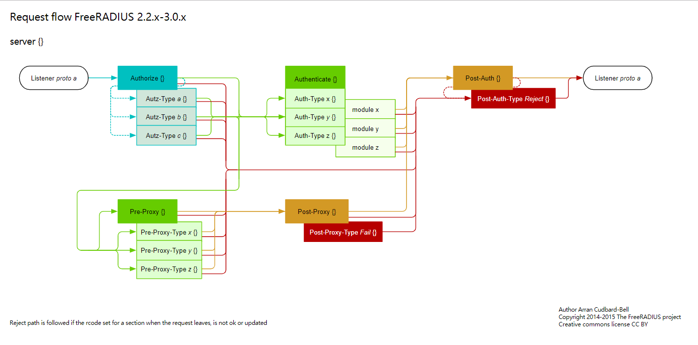

##  How things work in FreeRadius

## 0x00 序

RADIUS是目前使用最广泛的AAA协议.

FreeRadius是模块化, 高性能并且被广泛使用的radius服务器.

目前, 我们在以下项目都使用了FreeRadius:

- SSLVPN = OTP + FreeRadius
- NAC = 802.1x(EAP-TLS) + FreeRadius

对于FreeRadius的深入使用, 也对FreeRADIUS进一步学习. 在学习和实践的过程中, 发现FreeRadius官方提供了"Radius Concepts", 通过一个图来诠释FreeRadius的工作机制,  是一篇非常好的文章, 下面就结合自己的理解和大家做一个分享.

## 0x02 FreeRadius Request Flow

原图地址: https://wiki.freeradius.org/guide/request_flow.svg



为了便于理解, 可以忽略图中下半部分(红色线路), 下半部分表示Proxy场景下的流.

1. **Server: Ready to process requests**

2. **Client: Send auth request**

3. **Server: Picking an Auth-Type - authorize {}**

   服务器获取客户端认证请求:

   > Hmmm... 我是否可以处理这个请求?

   答案取决于服务器端的配置: 服务器支持的认证方式/服务器使用那些数据库/客户端请求内容.

   Freeradius收到认证请求后, 会将客户端请求转给authorize的不同模块:

   > #校验模块
   >
   > ##校验客户端请求中的用户名是否符合规范.
   >
   > filter_username
   >
   > 
   >
   > #预处理模块
   >
   > ##对客户端请求认证的内容, 进行标准化处理
   >
   > preprocess
   >
   > 
   >
   > #认证模块
   >
   > chap
   >
   > mschap
   >
   > eap
   >
   > 
   >
   > #数据库
   >
   > file
   >
   > sql
   >
   > ldap
   >
   > 
   >
   > #以上都无法处理,则尝试采用PAP认证
   >
   > PAP

   通过询问不同模块是否可以处理此客户端的请求, 不同模块对此认证的请求做出不同的动作. 如:

   filter_username 处理正常, 用户符合规范.

   preprocess处理正常, 数据都以进行标准化处理

   **认证模块**

   chap/mschap/eap根据客户端请求中的属性, 来判断是否可以处理, 如包含MS-CHAP-Challenge表示mschap可以处理, CHAP-Challenge表示chap可以处理, EAP-Message表示eap可以处理.

   > I can't authenticate this user now (I was just told to authorize them), but my pal in the Authenticate section can! Hey, set the Auth-Type to me!

   **注意:**

   ​	authorize阶段仅仅协商认证方式和处理的模块, 当服务器选择认证的方式后, 认证结果将由authenticate 中对应模块来验证认证是否成功.

   

   **数据库:**

   authorize同时也会对客户端请求的数据信息, 经过数据库进行预处理, file/sql中查询用户的相关信息.

   

4. **Authenticating a user - authenticate {}**

   经过上一步协商确认认证方式(Auth-Type), 假设Auth-type=PAP,  则调用authenticate{} PAP认证模块来进行认证.

   *I see a User-Password, which is what the user entered. That's nice, but I need to compare it with something. Ah! Another module added the "known good" password for this user in authorize!*

   PAP认证模块仅仅处理PAP认证, 并不处理认证结果. 而是将认证信息传递到后端的DB, 判断用户的认证结果是否正确, 若后端返回"know good"则表示认证结果是通过.

   这样做的好处可以支持多种认证方式: Files/SQL/LDAP/unix等.

5. **Post-Auth{}**

   不管是否认证成功, 在认证后, 都要经过post-auth, 此阶段主要用于认证日志记录.

可以看到不管是authorize还是autheticate都是并行处理的, 只要有对应的模块可以处理并且返回认证成功则表示这个请求是合法请求. 但是这一切的前提都是之前的模块没有明确返回拒绝(Auth-type=Reject).

FreeRadius的配置是与此流程相互对应的, 我们可以禁用启用相关的模块:

etc/raddb/sites-enabled/default

```bash
authorize {
        filter_username
        preprocess
        chap
        mschap
        digest
        suffix
        eap {
                ok = return
        }
        -sql
        -ldap
        expiration
        logintime
        pap
}
authenticate {
        Auth-Type PAP {
                pap
        }
        Auth-Type CHAP {
                chap
        }
        Auth-Type MS-CHAP {
                mschap
        }
        mschap
        digest
        eap
}
```

## 0x03 安全建议

由于FreeRadius的架构特性, 使用freeradius一定要进行严格的安全配置, 否则很容易出现安全问题. 

FreeRadius安全建议:

- 关闭不安全的认证模块(PAP/CHAP)
- 仅开启使用的安全认证模块(EAP-TLS/EAP-PEAP)
- 关闭不需要的数据库(files)
- 仅开启指定的数据库(sql)
- 使用EAP-TLS, 至少要开启CN验证(check_cert_cn)
- 禁用低版本的SSL协议(<= TLS 1.0)
- 开启日志审计

