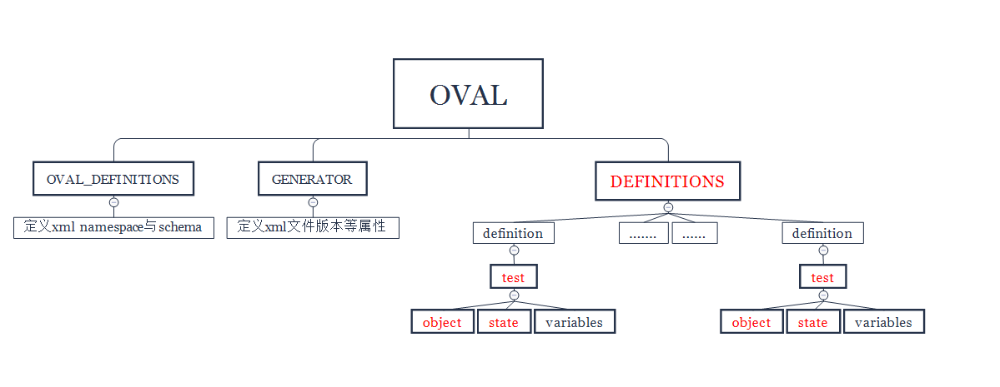
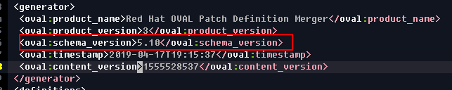
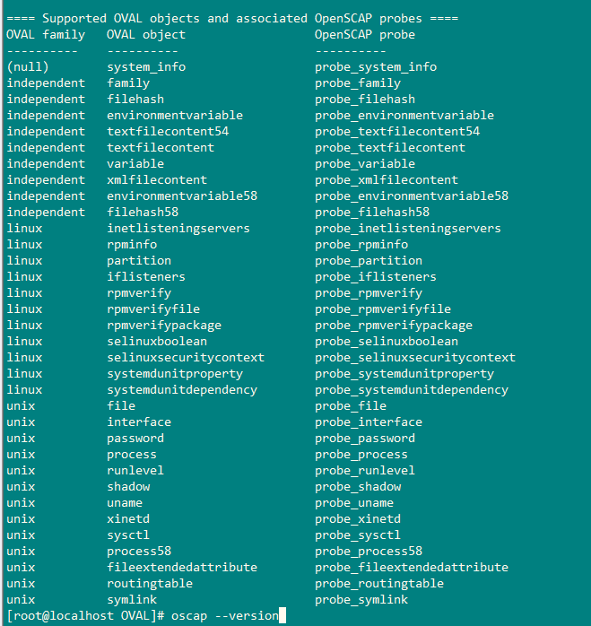
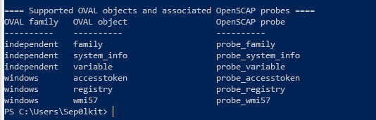
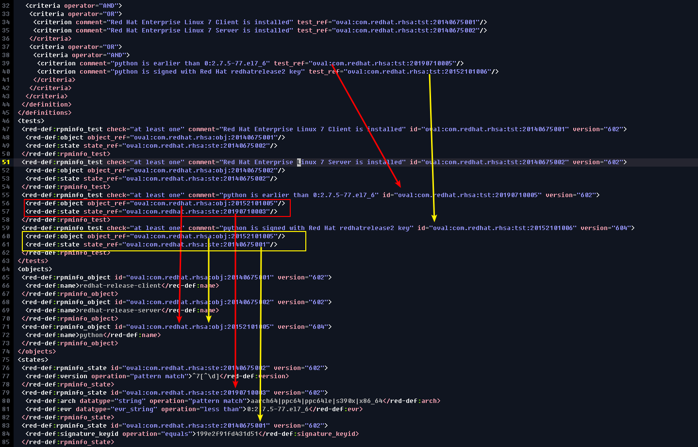

# OVAL 语法简介与示例

- **OVAL 简介**

  - **OVAL 与 SCAP**
  - **工作原理**
  - **应用场景**
  - **OVAL仓库**
- **OVAL 语法**
    - 语法结构
        - **defintions**
        - **tests**
        - **objects**
        - **states**
        - **variables**
    - **OVAL 示例**
- **OVAL 资源**
- **其他**

## OVAL简介

OVAL全称Open Vulnerability and Assessment Language, 即开放漏洞评估语言

OVAL是由MITER公司开发维护, 旨在标准化计算机系统安全状态评估, 提供开放和公开的系统安全评估检测内容.  目前OVAL项目捐赠给CIS, 可以在全球范围内免费使用.

**OVAL官网:**

https://oval.cisecurity.org/  (CIS)

https://oval.mitre.org/    (MITRE)

### OVAL 与 SCAP

OVAL是SCAP协议的基础组件之一, 也是其他组件的依赖组件, 如XCCDE/CPE等都是通过OVAL来定义的. 所以OVAL是SCAP协议的最基础的语言, 下面我们就讲一下OVAL语言的工作原理/有什么优势/可以解决那些问题/OVAL语法格式, 以及OVAL示例Demo.

### 工作原理

OVAL语言规范三个主要步骤, 用于实现计算机系统的安全状态评估:

 -	系统数据定义, 用于收集系统数据进行测试
 -	数据状态定义: 判断系统数据(漏洞/配置/补丁)是否符合定义的状态
 -	数据状态结果: 输出系统当前状态评估报告

我们可以将前两个步骤定义成xml文件, 通过oscap工具在待测系统上进行解析运行, 输出评估报告. 后面也会通过OVAL示例进行具体的说明.

### 应用场景

OVAL语言有什么优势, 他能解决那些问题? OVAL主要的应用场景有那些呢?

**应用场景:**

    - 漏洞定义分析
    - 资产定义分析
    - 配置定义分析

**优势/解决的问题:**

	- 明确给定系统是否存在软件漏洞/补丁/配置合规的检测方法
	- 基于可扩展标记语言(XML), 使用单个xml文档对问题进行详细描述
	- 合作支持, 系统发行商提供提供OVAL检测xml文档(redhat/ubuntu/cisco等)

OVAL应用的场景包括漏洞/资产/配置, 实际中OVAL主要用于漏洞定义. 资产以及配置应用场景结合其他语言来用如CPE/XCCDF, 下面我们从漏洞定义场景来介绍OVAL, 其他场景见后续文章.

### OVAL仓库

​	CIS提供了主流发行商的的oval漏洞定义文件, 可以直接下载使用.

**下载地址:**

​	https://oval.cisecurity.org/repository/download

> 注: 由于各个厂商支持力度以及开源社区等产品的关系, OVAL在落地实现是比较鸡肋的, 但是这套理念和技术标准, 还是有很大的指导意义.

## OVAL语法

### 语法结构

**OVAL文档结构**

```xml
<?xml version="1.0" encoding="utf-8"?>
<!-- namespace 与 schema声明-->
<oval_definitions>
<!-- xml文档信息(版本/发布时间等) -->
 <generator>
 </generator>
    
<!-- OVAL定义, 由若干条definition组成, 每一条definition包含若干属性和元素, 其中criteria为definition判断条件, 相应的tests查到object和state对比判断此definion是否存在-->
<!-- 说明1: definition属性class表示此定义的类别, 目前OVAL的类别有: compliance/inventory/miscellaneous/patch/vulnerablitity -->
<!-- 说明2: criteria由多条criterion组成判断逻辑, 通过criterion引用的test返回Bool型的值做逻辑运算 -->
<!-- 说明3: 这个是redhat提供的关于redhat oval的部分, 可以看到redhat的oval定义信息非常详细, 关于系统漏洞的所有信息, 我们基本都可以从这里获取的到 -->
 <definitions>
  <definition class="patch" id="" version="">
    <metadata>
    <title>RHSA-2019:0710: python security update (Important)</title>
    <affected family="unix">
     <platform>Red Hat Enterprise Linux 7</platform>
    </affected>
    <reference ref_id="RHSA-2019:0710-01" ref_url="" source="RHSA"/>
    <reference ref_id="CVE-2019-9636" ref_url="" source="CVE"/>
    <description></description>
    <advisory from="secalert@redhat.com">
     <severity>Important</severity>
     <rights>Copyright 2019 Red Hat, Inc.</rights>
     <issued date="2019-04-08"/>
     <updated date="2019-04-08"/>
     <cve cvss3="9.8/CVSS:3.0/AV:N/AC:L/PR:N/UI:N/S:U/C:H/I:H/A:H" cwe="CWE-172" href="" public="20190306">CVE-2019-9636</cve>
     <bugzilla href="" id="1688543"></bugzilla>
     <affected_cpe_list>
      <cpe>cpe:/o:redhat:enterprise_linux:7</cpe>
     </affected_cpe_list>
    </advisory>
   </metadata>
   <criteria operator="AND">
    <criteria operator="OR">
     <criterion comment="" test_ref=""/>
     <criterion comment="" test_ref=""/>
    </criteria>
    <criteria operator="OR">
     <criteria operator="AND">
      <criterion comment="" test_ref=""/>
      <criterion comment="" test_ref=""/>
     </criteria>
    </criteria>
   </criteria>   
  </definition>
  ......
  <definition class="patch" id="" version="">
  </definition>
 </definitions>
    
 <!-- tests是所有test的集合, oval规范了多种test模块, 这里只是其中的rpminfo模块 -->   
 <tests>
  <red-def:rpminfo_test check="" comment="" id="" version="">
  </red-def:rpminfo_test>
  ......
  <red-def:rpminfo_test check="" comment="" id="" version="">
  </red-def:rpminfo_test>
 </tests>
    
 <!-- objects 是所有objects的集合, object表示从哪里获取什么数据 -->  
 <objects>
  <red-def:rpminfo_object id="" version="">
   <red-def:name></red-def:name>
  </red-def:rpminfo_object>
  ......
  <red-def:rpminfo_object id="" version="">
   <red-def:name></red-def:name>
  </red-def:rpminfo_object>
 </objects>
  
    
 <!-- states 是所有state的集合, state表示数据应该满足什么样的条件(等于/小于/正则匹配等) -->    
 <states>
  <red-def:rpminfo_state id="" version="">
   <red-def:version operation="pattern match">^7[^\d]</red-def:version>
  </red-def:rpminfo_state>
  ......
  <red-def:rpminfo_state id="" version="">
   <red-def:version operation="pattern match">^7[^\d]</red-def:version>
  </red-def:rpminfo_state>
 </states>
    
 <!-- variables 是所有variable的集合, variables不是必须的, 可以在将值直接写在其他定义模块. -->    
 <variables>
  <local_variable comment="" datatype="" id="" version="">
 </variables>   
     
</oval_definitions>
```

**OVAL解析结构**



可以看到OVAL单个文档都是非常模块化的, 模块化就会非常的灵活. 而且OVAL是严格校验的, 有很多点是需要注意的.

可以简单总结成公式:   

```
definition = test(object, state)
```

**注意事项:**

1. oval是有版本要求的,  oval扫描工具的要支持此oval语言的版本.

   xml中generator:schema_version中定义了xml所需要的oval版本

   

   openscap中oval版本支持(向下兼容):

   

2. 目前厂商提供的OVAL都指的是狭义的oval, 即系统补丁信息.

3. oval针对不同的系统, 规范了不同的probes, 也可以理解为test模块, 但是目前openscap仅仅实现了部分模块.

   **osap on linux:**

   

   **oscap on windows:**

   ​			


### OVAL 示例

OVAL都是非常庞大的, 如红帽提供给的针对redhat7的OVAL定义多达16w行, 分析起来非常晦涩难懂. 我摘取了其中一条检测规则, 简化成oval-demo示例,

参见: [com.redhat.rhsa-RHEL7-Demo.xml](https://github.com/Sep0lkit/Blog/tree/master/posts/_assets/oval-demo/com.redhat.rhsa-RHEL7-Demo.xml)

规则解读: 系统为Redhat7, 当python包的版本小于2.7.5-77.el7_6且使用redhatrelease2 key签名时, 则此definition返回true.



## OVAL 资源

目前主流的系统和软件提供商都提供oval仓库, 如:

- [Redhat](https://www.redhat.com/security/data/oval/)
- [Ubuntu](https://people.canonical.com/~ubuntu-security/oval/)
- [Debian](https://www.debian.org/security/oval/)
- [Oracle Linux](https://linux.oracle.com/security/oval/)
- [SUSE](http://ftp.suse.com/pub/projects/security/oval/)

## 其他:

- 不说oval这个标准落地的效果, 这个规范标准的思想是值得我们去学习和借鉴的
- redhat开源一哥的地位真不是吹出来的, 对比其他家的oval你就知道redhat比他们强的不是一点.
- redhat会校验软件包签名来降低误报率

**企业改如何使用OVAL:**

- 如果你自研发相关产品, OVAL是非常好的系统漏洞威胁情报源
- 如果你没有强大的研发能力, 可以应用openscap, 自定义oval文档.
- 你也可以通过ansible/hids等系统, 对系统进行资产漏洞评估.

openscap使用oval请参考前文: 安全自动化协议(SCAP)-资产漏洞评估示例


**广告:**

centos虽然基于redhat, 但是redhat的oval是无法在centos上使用的, 如果你的企业大部分都是使用centos, 可以考虑使用我转化后的oval: https://github.com/Sep0lkit/oval-for-el 