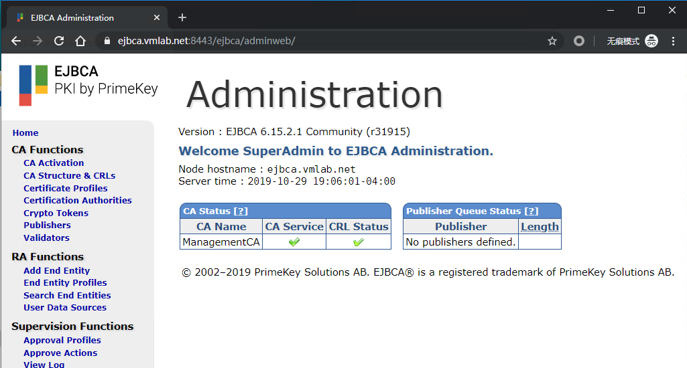

# PKI方案-ejbca环境搭建

**系统环境:**

​	centos 7.6.1810(x64)

​	apache-ant-1.9.14

​	jdk-8u212-linux-x64.rpm

​	apache-ant-1.9.14-bin

​	ejbca_ce_6_15_2_1.zip


## 0x00 环境配置

### 系统环境初始化

```bash
#设置主机名
hostnamectl set-hostname ejbca.vmlab.net

#绑定hosts
echo "192.168.8.72 ejbca.vmlab.net" >> /etc/hosts
```

### JDK环境

下载地址: https://www.oracle.com/technetwork/java/javase/downloads/jdk8-downloads-2133151.html

```bash
#安装jdk
rpm -ivh jdk-8u212-linux-x64.rpm

#配置环境变量
/etc/profile末尾添加:
#JDK Env
JAVA_HOME=/usr/java/jdk1.8.0_212-amd64/
JRE_HOME=/usr/java/jdk1.8.0_212-amd64/jre
CLASSPATH=.:$JAVA_HOME/lib/dt.jar:$JAVA_HOME/lib/tools.jar:$JRE_HOME/lib

PATH=$PATH:$JAVA_HOME/bin:$JRE_HOME/bin
```

配置JDK Cryptography Extension (JCE)

```bash
#下载JCE, 地址: http://www.oracle.com/technetwork/java/javase/downloads/jce8-download-2133166.html

# 解压将jar文件复制到目录$JRE_HOME/lib/security
cp local_policy.jar  US_export_policy.jar /usr/java/jdk1.8.0_212-amd64/jre/lib/security/
```

### Mysql环境:

```bash
#yum安装配置mariadb
yum -y install mariadb mariadb-server
systemctl start mariadb
/usr/bin/mysql_secure_installation
```

### **ANT环境:**

```bash
#下载配置apache-ant
wget http://mirrors.tuna.tsinghua.edu.cn/apache//ant/binaries/apache-ant-1.9.14-bin.tar.gz
tar -xzvf apache-ant-1.9.14-bin.tar.gz
mv apache-ant-1.9.14 /usr/local/ant

#修改环境变量
PATH=$PATH:$JAVA_HOME/bin:$JRE_HOME/bin:/usr/local/ant/bin
```


## 0x01 wildfly配置部署(jboss)

```bash
#下载解压
wget https://download.jboss.org/wildfly/12.0.0.Final/wildfly-12.0.0.Final.tar.gz
tar -xzvf wildfly-12.0.0.Final.tar.gz

```

### **配置wildfly-mysql驱动:**

```
#下载mysql-connector-java-5.1.48.jar, 地址: https://dev.mysql.com/downloads/connector/j/5.1.html

 mkdir -p modules/system/layers/base/com/mysql/jdbc/main
 cd modules/system/layers/base/com/mysql/jdbc/main/
 cp /opt/primeky/mysql-connector-java-5.1.48.jar ./
 
 #配置module.xml
 cp ../../../github/fge/json-patch/main/module.xml ./ 
```

**- module.xml**

```xml
<?xml version="1.0" encoding="UTF-8"?>
<module name="com.mysql.jdbc" xmlns="urn:jboss:module:1.7">

    <resources>
        <resource-root path="mysql-connector-java-5.1.48.jar"/>
    </resources>

    <dependencies>
        <module name="javax.api"/>
        <module name="javax.transaction.api"/>
    </dependencies>

</module>
```

**- standalone.xml**

```xml
#找到datasources-drivers, 添加节点
<driver name="mysql" module="com.mysql.jdbc">
	<xa-datasource-class>com.mysql.jdbc.jdbc2.optional.MysqlXADataSource</xa-datasource-class>
</driver>
```

### **配置wildfly datasources:**

```bash
#创建数据库
MariaDB [(none)]> create user 'ejbca'@'localhost' identified by 'ejbca';
MariaDB [(none)]> grant all on ejbca.* to 'ejbca'@'localhost';

```

**- standalone.xml**

```xml
# 在datasources添加 datasource节点
<datasource jta="true" jndi-name="java:/EjbcaDS" pool-name="EjbcaDS" enabled="true" use-ccm="true">
    <connection-url>jdbc:mysql://localhost:3306/ejbca</connection-url>
    <driver-class>com.mysql.jdbc.Driver</driver-class>
    <driver>mysql</driver>
    <security>
        <user-name>ejbca</user-name>
        <password>ejbca</password>
    </security>
    <validation>
        <valid-connection-checker class-name="org.jboss.jca.adapters.jdbc.extensions.mysql.MySQLValidConnectionChecker"/>
        <background-validation>true</background-validation>
        <exception-sorter class-name="org.jboss.jca.adapters.jdbc.extensions.mysql.MySQLExceptionSorter"/>
    </validation>
</datasource>
```

### **启动wildfly,并测试**

```bash
#修改wildfly启动选项, 如内存分配等
# vi bin/standalone.conf
JAVA_OPTS="-Xms512m -Xmx1024m -XX:MetaspaceSize=512M -XX:MaxMetaspaceSize=512m -Djava.net.preferIPv4Stack=true"

#启动
./bin/standalone.sh

./bin/jboss-cli.sh  -c
/subsystem=datasources:installed-drivers-list
/subsystem=datasources:read-resource

#能够看到mysql驱动和EjbcaDS data-source
```

### 配置wildfly EJB

```
#注意:  ejbca的ejbca-ejb-client需要使用EJB功能(remoting), 所以需要配置EJB.

/bin/jboss-cli.sh  -c
/subsystem=remoting/http-connector=http-remoting-connector:write-attribute(name=connector-ref,value=remoting)
/socket-binding-group=standard-sockets/socket-binding=remoting:add(port=4447,interface=management)
/subsystem=undertow/server=default-server/http-listener=remoting:add(socket-binding=remoting,enable-http2=true)
/subsystem=infinispan/cache-container=ejb:remove()
/subsystem=infinispan/cache-container=server:remove()
/subsystem=infinispan/cache-container=web:remove()
/subsystem=ejb3/cache=distributable:remove()
/subsystem=ejb3/passivation-store=infinispan:remove()
:reload()

#验证EJB功能是否开启, 返回java进程则证明EJB功能以及配置成功.
lsof -i :4447

```

## 0x02 EJBCA配置部署

### 修改配置文件

**install.properties**

```bash
cp install.properties.sample  install.properties

#变更内容
diff install.properties install.properties.sample 
23c23
< ca.dn=CN=ManagementCA,O=VMLAB,C=CN
---
> ca.dn=CN=ManagementCA,O=EJBCA Sample,C=SE

#说明: install中的配置是针对ejbca初始化配置时生成用于管理员访问管理的证书配置, 可以不做修改.
```

**cesecore.properties[重要]**

```bash
cp cesecore.properties.sample cesecore.properties

#变更内容
diff cesecore.properties cesecore.properties.sample      
30d29
< password.encryption.key=8B8gpscy05RKj23jYRJIkmZYpZjKSYg1
46d44
< ca.keystorepass=ZYpZjKSYg1

#说明: 
#这个配置文件一定要做好备份, 升级或者重新部署需要里面的密码字段用于数据解密
# password.encryption.key  	数据库密码加密key
# ca.keystorepass			CA密钥对加密key
```

**ejbca.properties**

```bash
...

diff ejbca.properties ejbca.properties.sample 
23d22
< appserver.home=/opt/primeky/wildfly-12.0.0.Final
58d56
< ca.cmskeystorepass=ZYpZjKSYg1

#说明:
#appserver.home执行jboos的路径
#ca.cmskeystorepass ejbca cms服务密钥对加密key, 和 ca.keystorepass保持一致即可
```

**web.properties[重要]**

```bash
...

diff web.properties web.properties.sample 
26c26
< java.trustpassword=trustedpass
---
> java.trustpassword=changeit
33c33
< superadmin.dn=CN=${superadmin.cn},O=VMLAB
---
> superadmin.dn=CN=${superadmin.cn}
48c48
< httpsserver.password=httpspass
---
> httpsserver.password=serverpwd
51c51
< httpsserver.hostname=ejbca.vmlab.net
---
> httpsserver.hostname=localhost
55c55
< httpsserver.dn=CN=${httpsserver.hostname},O=VMLAB
---
> httpsserver.dn=CN=${httpsserver.hostname},O=EJBCA Sample,C=SE

#说明:
#java.trustpassword 		是ejbca安装生成的双向证书的加密密码	
#httpsserver.password		是ejbca安装生成默认https证书的加密密码
#httpsserver.hostname		主机名称
#superadmin.password		这个没有改, 这个密码是生成的客户端证书的导入密码
###每个密码不同, 是为了更好的理解这些密码的地方, 如果不理解就都全部使用一个密码
```

**database.properties**

```bash
...

diff database.properties database.properties.sample 
26d25
< database.name=mysql
42d40
< database.url=jdbc:mysql://127.0.0.1:3306/ejbca?characterEncoding=UTF-8
59d56
< database.driver=com.mysql.jdbc.Driver
63c60
< database.username=ejbca
---
> #database.username=ejbca
67c64
< database.password=ejbca

#数据库账号密码, 请根据自己配置自行更改
```

### 部署安装

```
#deploy, 成功则出现: BUILD SUCCESSFUL
ant  clean deployear
#等待/等待/等待 wildfly 日志输出  Deployed "ejbca.ear" (runtime-name : "ejbca.ear")

ant  runinstall

#安装TLS keystores, 将p12生成的证书部署到wildfly(configuration/keystore/)
ant  deploy-keystore

#密钥说明:
p12/
├── superadmin.p12			#ejbca管理后台双向验证客户端证书,需要导入到本地计算机用户证书库
├── tomcat.jks				#https单向TLS证书
└── truststore.jks			jbca管理后台双向验证服务器端证书,

验证证书:
keytool -v -list -keystore p12/truststore.jks  	密码:trustedpass
keytool -v -list -keystore p12/tomcat.jks 		密码:httpspass
keytool -v -list -keystore p12/superadmin.p12	密码:ejbca

#验证这些密码是否可以正确且完整的解密, 否则下面很容易出错, 密码一定要和配置文件做好对应.
```

**Tips:** 如果嫌弃修改配置文件比较麻烦, 可以只修改database和ejbca的配置文件即可,  ant runinstall通过交互方式设置其他选项

## 0x03 ejbca wildfly配置

### **wildfly配置端口:**

```bash
### 删除默认的HTTP端口
/subsystem=undertow/server=default-server/http-listener=default:remove()
/subsystem=undertow/server=default-server/https-listener=https:remove()
/socket-binding-group=standard-sockets/socket-binding=http:remove()
/socket-binding-group=standard-sockets/socket-binding=https:remove()
:reload()

### 新增网卡和socket
/interface=http:add(inet-address="0.0.0.0")
/interface=httpspub:add(inet-address="0.0.0.0")
/interface=httpspriv:add(inet-address="0.0.0.0")
/socket-binding-group=standard-sockets/socket-binding=http:add(port="8080",interface="http")
/socket-binding-group=standard-sockets/socket-binding=httpspub:add(port="8442",interface="httpspub")
/socket-binding-group=standard-sockets/socket-binding=httpspriv:add(port="8443",interface="httpspriv")
```


### wildfly加载证书

```bash
#加载tomcat.jks
/subsystem=elytron/key-store=httpsKS:add(path="keystore/keystore.jks",relative-to=jboss.server.config.dir,credential-reference={clear-text="httpspass"},type=JKS)
/subsystem=elytron/key-manager=httpsKM:add(key-store=httpsKS,algorithm="SunX509",credential-reference={clear-text="httpspass"})

#加载truststore.jks
/subsystem=elytron/key-store=httpsTS:add(path="keystore/truststore.jks",relative-to=jboss.server.config.dir,credential-reference={clear-text="trustedpass"},type=JKS)
/subsystem=elytron/trust-manager=httpsTM:add(key-store=httpsTS)

#创建SSL-CONTENT
/subsystem=elytron/server-ssl-context=httpspub:add(key-manager=httpsKM,protocols=["TLSv1.2"])
/subsystem=elytron/server-ssl-context=httpspriv:add(key-manager=httpsKM,protocols=["TLSv1.2"],trust-manager=httpsTM,need-client-auth=true,authentication-optional=false,want-client-auth=true
```

### **wildfly配置HTTP监听:**

```bash
###配置http undertow
/subsystem=undertow/server=default-server/http-listener=http:add(socket-binding="http", redirect-socket="httpspriv")
/subsystem=undertow/server=default-server/https-listener=httpspub:add(socket-binding="httpspub", ssl-context="httpspub", max-parameters=2048)
/subsystem=undertow/server=default-server/https-listener=httpspriv:add(socket-binding="httpspriv", ssl-context="httpspriv", max-parameters=2048)
:reload()
```

## 0x04 系统和客户端配置

### 服务器防火墙规则

```bash
#开启防火墙端口: 8080/8442/8443, 8443仅允许管理IP访问
firewall-cmd --zone=public --permanent --add-port="8080/tcp"
firewall-cmd --zone=public --permanent --add-port="8442/tcp"
firewall-cmd --zone=public --permanent --add-rich-rule="rule family="ipv4" source address="192.168.8.2" port protocol="tcp" port="8443" accept"

#开启wildfly的console管理端口:9990
firewall-cmd --zone=public --permanent --add-rich-rule="rule family="ipv4" source address="192.168.8.2" port protocol="tcp" port="9990" accept"

firewall-cmd --reload
```

**客户端配置:**

​	**下载superadmin.p12到本地, 并导入, 重启浏览器然后访问**

​	访问ejbca管理后台:

​	

### 0x05 其他:

- **如果搭建不成功, 请务必按照本文的所有配置来, 理解每个配置项后再自行更改.**
- **本文是按照product的理念来部署的[自定义加密密钥和证书信息], 可以用于企业部署参考**
- **踩了很多坑, 关键的都已经写到文档里面了**

### <u>切记: 配置备份 / 配置备份 / 配置备份</u>