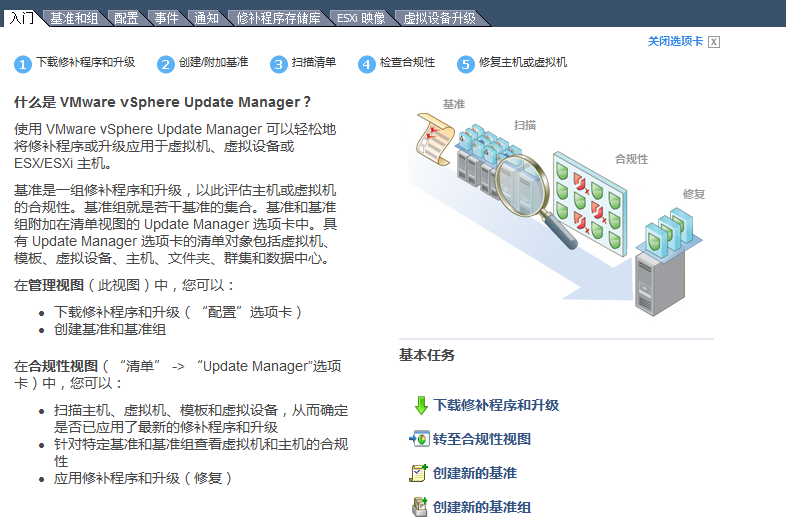
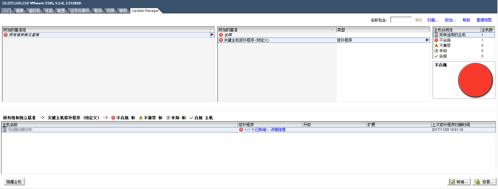
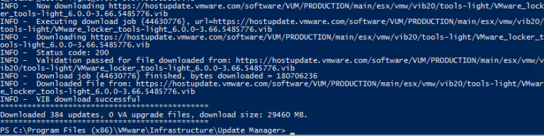

### VMWare虚拟化安全基准与更新
-Project: 基础安全建设-虚拟化.VMware更新服务

	0x00 VUM简介
	0x01 VUM安装、配置
	0x02 VUM使用及示例
	0x03 UMDS简介
	0x04 UMDS安装、配置、使用
	0x05 VUM使用UMDS更新服务

#### 0x00 VUM简介
虚拟化经过多年的发展，已然成为IT领域的主流技术。 已经有越来越多的企业在大规模的使用虚拟化，vmware vSphere是目前使用比较广泛虚拟化方案。
当越来越多的主机运行在虚拟化之上时，我们不仅需要关注运行在虚拟化里面虚拟主机的安全性，同时更需要关注虚拟化产品本身的安全性。 
<!-- ToDo: 虚拟化存在的安全风险 -->

虚拟化基础安全： 
 - 安全基准&基准核查
 - 漏洞修复&系统更新

VUM(vSphere Update Manager)是vmware针对虚拟化方案推出的安全管理工具，可以实现对ESXI以及第三方的软件进行安全检查与更新。VUM是以vCenter的一个可选的功能香，
通过配置vCenter的VUM服务，可以对vCenter虚拟化集群进行统一的安全管理。

#### 0x01 VUM安装、配置
VUM的安装可以参考：[安装配置VMware vSphere Update Manager 6.0](http://www.azurew.com/4589.html)

>注意: VUM版本信息应与vCenter的版本保持一致

##### 防火墙
如果网络中存在防火墙设备，需要开通以下规则:


| 	Name 	| 	Direction 	| 	Comment 			|
| 	---- 	| 	--------- 	| 	------- 			|
| TCP 80	|VUM -> vCenter | Connection to vCenter	|
| TCP 9084  |Hosts -> VUM   | Host patch downloads  |
| TCP 902   |VUM -> ESXI    |Push VMs and host upgrade files |
| TCP 80,443|VUM -> WAN     |Access to online repository (vmware.com) |
| TCP 9087  |Client Plug-in -> VUM | Uploading upgrade files |
| TCP 8084  |Client Plug-in -> VUM | VUM SOAP service |
| TCP 9000-9100 |VUM -> WAN | Alternative ports (if you are not planning to use 80,443) |

#### 0x02 VUM使用

	1. 下载修补程序和升级
	2. 创建/附加基准
	3. 扫描清单
	4. 检查合规性
	5. 修复主机或虚拟机

安装配置后VUM后，可以通过vSphere Client连接到vCenter集群，安装Update Manager插件。 之后就可以在主页看到Update Manager, 进入Update Manager如下:


Update Manager默认内置了默认的vmware更新源, 定时从更新源下载vSphere ESXI、ESXI修补程序以及虚拟设备。

Update Manager与定义了两个主机基准以及三个虚拟机/虚拟设备基准：

主机基准:
	- 非关键主机修补程序(预定义)
	- 关键主机修补程序(预定义)

虚拟机/虚拟设备:
	- 升级VMWare Tools以匹配主机(预定义)
	- 升级虚拟机硬件以匹配主机(预定义)
	- 将虚拟设备升级到最新版本(预定义)

通过查看预定义的基准我们可以看到自定义一个基准的过滤条件:

	- 基准类型:
		动态: 基于条件的更新, 后续的更新如符合条件也会被包含在此基准里面
		静态: 从现有的修复程序存储库中选取修补程序作为基准，除非手动编辑否则不会产生变动
	- 修补程序提供商&产品
	- 严重性(任何/低/中等/重要/严重)
	- 类别(任何/安全/缺陷修复/增强功能/其他)
	- 发行时间

我们可以根据我们的需求创建相应的基准, 然后切换到"主机和集群"的页面, 点击集群或者单独主机的Update Manager页面, 给这个集群或者主机附加相应的基准.
点击扫描即可对主机进行基准核查, 可以在任务中看到扫描的进度. 


扫描完毕我们即可看到主机的检查报告, 点击详细信息可以查看到具体的漏洞和补丁信息. 我们可以对主机执行以下操作:

	转储: 将补丁下载到主机但是不执行修复更新
	修复: 创建相应的修复任务, 执行补丁修复任务

#### 0x03 UMDS简介
vShpere Update Manager Download Service(UMDS)是VUM的一个可选工具, 通过UMDS可以下载vmware虚拟化程序、补丁更新以及安全通告等。

VUM可以实现在线补丁更新, 我们为什么还需要UMDS呢? 

	在企业网络中, VUM服务器完全处于核心的网络中, 无法访问互联网
	VUM和vCenter只能实现一一对应, 当存在多个vCenter时, 可以通过部署多台VUM指向同一台UMDS更新仓库以节省网络和存储资源

#### 0x04 UMDS安装、配置、使用
UMDS安装可以通过vCenter安装程序, 选择vSphere Update Manager下的Download Service服务, 选择数据库类型安装即可.

安装完成后我们可以通过vmware-umds命令配置umds服务, vmware-umds命令默认安装在: C:\Program Files(x86)\Vmware\Infrastructure\Update Manager.

列出所有参数: vware-umds

列出当前的配置: vmware-umds -G
```
PS C:\Program Files (x86)\VMware\Infrastructure\Update Manager> .\vmware-umds -G
Configured URLs
URL Type Removable URL
HOST NO
HOST NO https://hostupdate.vmware.com/software/VUM/PRODUCTION/main/vmw-depot-index.xml
HOST NO https://hostupdate.vmware.com/software/VUM/PRODUCTION/csco-main/csco-depot-index.xml
VA NO http://vapp-updates.vmware.com/vai-catalog/index.xml

Patch store location : C:\Patch-Store
Export store location :
Proxy Server : Not configured

Host patch content download: enabled
Host Versions for which patch content will be downloaded:
embeddedEsx-6.0.0-INTL
embeddedEsx-5.0.0-INTL
embeddedEsx-5.1.0-INTL
embeddedEsx-5.5.0-INTL

Virtual appliance content download: disabled
```

列出UMDS所支持的主机平台: vmware-umds --list-host-platforms
```
PS C:\Program Files (x86)\VMware\Infrastructure\Update Manager> .\vmware-umds.exe --list-host-platforms
Supported ESX Host platforms:
 embeddedEsx-5.0.0
 embeddedEsx-5.1.0
 embeddedEsx-5.5.0
 embeddedEsx-6.0.0
 
```

修改UMDS存储位置:
```
PS C:\Program Files (x86)\VMware\Infrastructure\Update Manager> .\vmware-umds -S --patch-store C:\Patch-Store
```

源操作:
```
#添加更新的源
vmware-umds -S --add-url https://download_URL/index.xml --url-type HOST
#删除更新源
vmware-umds -S --remove-url https://download_URL/index.xml
```

补丁选择:
```
#当我们的环境中没有某些平台时, 可以通过下面的命令进行禁用
PS C:\Program Files (x86)\VMware\Infrastructure\Update Manager> .\vmware-umds -S -d embeddedEsx-5.0.0-INTL
File path = C:\Program Files (x86)\VMware\Infrastructure\Update Manager\downloadConfig.xml
Setting up UMDS configuration
Host update downloads for platform embeddedEsx-5.0.0-INTL: Disabled

#禁用虚拟应用更新, 仅仅使用主机更新
PS C:\Program Files (x86)\VMware\Infrastructure\Update Manager> .\vmware-umds -S --enable-host --disable-va
```

补丁下载:

执行vmware-umds -D, UMDS会根据当前的配置下载补丁更新. 下载完毕后你可以看到具体的更新数量和大小.


#### 0x05 VUM使用UMDS更新服务
通过UMDS下载的更新补丁, 我们可以通过以下两种方式导入到VUM中.

方式一:
导出更新到移动存储设备然后在vSphere中导入到VUM中
```
PS C:\Program Files (x86)\VMware\Infrastructure\Update Manager> .\vmware-umds -E --export-store C:\Patch-Repo
INFO - Initializing connection pool
```

方式二(推荐):
通过Web服务器指向补丁下载目录(HTTP仓库), 配置VUM使用共享库为HTTP仓库地址

	- 添加IIS角色
	- 添加虚拟目录指向补丁下载目录
	- 添加 .vib .sig 的MIME Types为: application/octet-stream
	- 开启目录索引
	- 配置VUM使用共享仓库

(完)