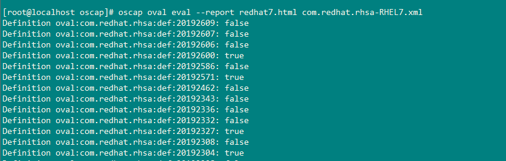
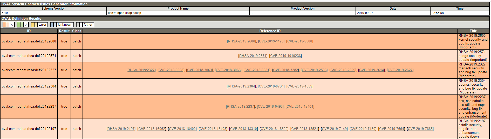

# 资产漏洞评估实践-OVAL检测CentOS系统漏洞

- **企业资产漏洞评估**
  - **资产漏洞评估需求**
  - **资产漏洞评估方法**
- **资产漏洞评估实践**
  - **CentOS系统安全评估**
  - **其他说明**

这是SCAP的第三篇, 阅读前请先阅读前两篇:

-	[安全内容自动化协议(SCAP)](https://github.com/Sep0lkit/Blog/issues/3)
-	[OVAL 语法简介与示例](https://github.com/Sep0lkit/Blog/issues/9)

## 企业资产漏洞评估

资产漏洞评估即识别目标系统的软件服务, 标识是否存在已知的安全漏洞.

我们结合历史的安全漏洞, 列出下几个场景:

1. OpenSSl-心脏滴血漏洞
2. Bash-破壳漏洞
3. DHCP-dhcp-client命令注入漏洞 (CVE-2018-1111)

当某个软件或者服务出现严重漏洞的时候, 尤其是基础组件服务, 我们是如何处理的呢? 对于后续的业务系统我们如何持续性评估呢? 

**安全应急环节:**

 -	发布企业内部安全通告
 -	漏洞资产检查
   - 网络扫描
   - 管理员自查
   - 终端安全扫描
 -	漏洞资产确认
 -	漏洞资产修复

**安全后续:**

安全应急后续的持续性工作, 这里情况就多了.

- 第一种: 后续就是没有后续了.
- 第二种: 添加网络扫描规则/封装了新的系统镜像
- 第三种: 添加终端扫描规则
- 第N种: ...

在安全应急环节中, 我把漏洞资产检查和确认划分为两个阶段, 主要出于以下两个考虑:

1. 网络扫描/终端扫描的准确性
2. 对于某些安全漏洞, 业务系统管理员不具备"漏洞确认"的能力.

通过上面列出的三个漏洞场景以及漏洞处置的环节, 我们可以得出以下几个结论:

- 网络扫描针对网络类漏洞处理快速有效
- 网络扫描只能检查确属存在的漏洞, 而不可以检查潜在风险的漏洞(如openssl属于受影响的版本, 但是系统目前并未使用openssl对外提供服务)
- 不是所有业务系统管理员都具备漏洞确认"的能力, 安全人员应该提供确切的检测结论:"是/否"
- 终端安全扫描是最优化的解决方案
- 终端安全扫描需要解决的几个问题:  **漏洞定义(漏洞检测准确率) + 漏洞定义持续性更新 +  漏洞检查持续性**

### 资产漏洞评估需求

结合以上的结论以及企业业务特点, 资产漏洞评估基本需求如下:

- 确定资产防护的对象和类型
- 使用终端安全扫描方式
- 支持离线方式
- 提供直观的系统是否受影响的结果
- 准确的漏洞定义
- 持续性的漏洞定义更新 & 持续性的漏洞检查

### 资产漏洞评估方法

目前我们线上业务主要以CentOS系统为主以及少量的windows系统,  针对CentOS系统进行资产漏洞评估方面, 我们使用SCAP框架, 通过OVAL来实现对CentOS资产漏洞评估. 

Redhat oval是redhat针对redhat系统提供的oval定义, 我们通过redhat oval 和 scap框架可以实现对线上系统的安全评估.

Redhat oval : https://www.redhat.com/security/data/oval/

由于redhat oval是针对redhat系统, centos虽然基于redhat, 但是redhat的oval是无法在centos上使用的. 这里可以使用我修改后适配centos的oval:  https://github.com/Sep0lkit/oval-for-el (与redhat oval持续更新)


## **资产漏洞评估实践**

为了实现自动化和持续化的检查,  通常会将scap oval集成到终端安全产品中.  这里我们为了获取直观的效果, 我们使用openscap进行离线漏洞检查.

### **CentOS系统安全评估**

```bash
#Download oval
git clone git@github.com:Sep0lkit/oval-for-el.git

cd oval-for-el
#使用oscap检测所有漏洞
oscap oval eval --report centos7-report.html centos/com.redhat.rhsa-EL7.xml

#使用oscap检测安全等级为:critical的漏洞
oscap oval eval --report centos7-critical-report.html centos/com.redhat.rhsa-EL7-Critical.xml 
```

**Console输出:**



**HTML报表:**



Class=patch AND Result=true的表示系统上存在此漏洞, 以及漏洞对应的CVE和Title. 

### **其他**

- 使用oval-for-el存在一定的误报率, 是由于redhat和centos的rpm包名称并非都是完全保持一致
- redhat开源一哥的地位真不是吹出来的, 对比其他家的oval你就知道redhat比他们强的不是一点.
- redhat会校验软件包签名来降低误报率

**企业改如何使用OVAL:**

- 如果你自研发相关产品, OVAL是非常好的系统漏洞威胁情报源
- 如果你没有强大的研发能力, 可以使用openscap+自定义oval
- 你也可以通过ansible/hids等系统, 对系统进行资产漏洞评估.

